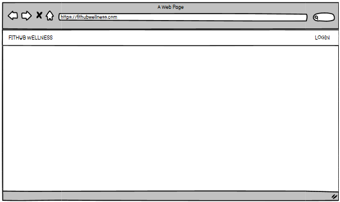

# Historia de usuario 10: Inicio de sesión

- Yo: como usuario de la aplicación,
- Quiero: poder iniciar sesión en la aplicación con mi cuenta de Google,
- Para: poder acceder a mis datos y rutinas de ejercicios.

## Especificación de requerimientos

- El sistema debe permitir al usuario iniciar sesión con su cuenta de Google.

## Análisis

A continuación se presenta la pantalla de inicio de sesión, cuyo funcionamiento es:

1. El usuario hace click en el botón de "LOGIN".
2. El sistema redirige al usuario a la página de 0Auth de Google para que inicie sesión.
3. El usuario inicia sesión con su cuenta de Google.

## Critertios de aceptación

#### Prototipo de baja fidelidad

- Dado: que el usuario ha entrado a la aplicación.
- Cuando: el usuario hace click en el botón de "LOGIN".
- Entonces: el sistema redirige al usuario a la página de 0Auth de Google para que inicie sesión.
