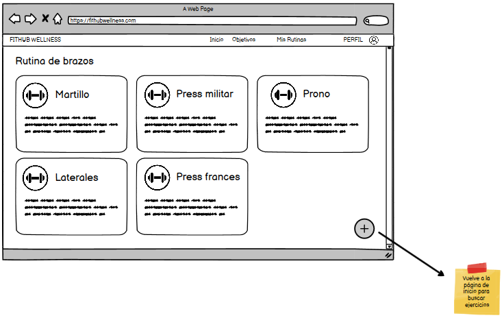

# Historia de usuario 30: Añadir ejercicio a rutina

- Yo: como usuario de la aplicación,
- Quiero: poder añadir un ejercicio a una rutina de ejercicios,
- Para: poder seguir una rutina de ejercicios personalizada.

## Especificación de requerimientos

- El sistema debe permitir al usuario añadir un ejercicio a una rutina de ejercicios existente.
- El sistema debe permitir al usuario añadir un ejercicio a una nueva rutina de ejercicios.

## Análisis

A continuación se presenta la pantalla de añadir ejercicio a rutina, cuyo funcionamiento es:

1. El usuario encuentra todos los ejercicios que puede realizar en la página de inicio.
2. El usuario hace click en el botón de "Añadir ejercicio" de un ejercicio.
3. El sistema muestra al usuario la opción de añadir un ejercicio a una rutina de ejercicios existente.
4. El usuario puede seleccionar una rutina de ejercicios existente.
5. El usuario puede seleccionar crear una nueva rutina de ejercicios.


A continuación se presenta la pantalla de mis rutinas, cuyo funcionamiento es:

1. El usuario hace click en el botón de "Mis rutinas".
2. El sistema muestra al usuario todas las rutinas de ejercicios que ha creado.
3. El usuario puede seleccionar una rutina de ejercicios.
4. El sistema muestra al usuario los ejercicios que contiene la rutina de ejercicios.
5. El usuario puede añadir un ejercicio a la rutina de ejercicios.



## Critertios de aceptación

#### Prototipo de baja fidelidad

- Dado: que el usuario está en la página de inicio.
- Cuando: el usuario hace click en el botón de "Añadir ejercicio" de un ejercicio.
- Entonces: el sistema muestra al usuario la opción de añadir un ejercicio a una rutina de ejercicios existente o crear una nueva rutina de ejercicios.

#### Prototipo de baja fidelidad

- Dado: que el usuario está en la página de mis rutinas.
- Cuando: el usuario hace click en el botón de "Añadir ejercicio" de una rutina de ejercicios.
- Entonces: el sistema vuelve a la página de inicio y muestra al usuario la opción de añadir un ejercicio a una rutina de ejercicios existente o crear una nueva rutina de ejercicios.

## Diseño

### Integración con las APIs

#### Al momento de añadir un ejercicio a una rutina de ejercicios existente

- Request: `POST /api/v1/rutinas/{id}/ejercicios/`

```json
{
    "name": "Ejercicio 3",
    "description": "Descripcion del ejercicio 3"
}
```

- Response: `200 OK`

```json
{
    "id": 1,
    "name": "Rutina 1",
    "ejercicios": [
        {
            "id": 1,
            "name": "Ejercicio 1",
            "description": "Descripcion del ejercicio 1"
        },
        {
            "id": 2,
            "name": "Ejercicio 2",
            "description": "Descripcion del ejercicio 2"
        },
        {
            "id": 3,
            "name": "Ejercicio 3",
            "description": "Descripcion del ejercicio 3"
        }
    ]
}
```

#### Al momento de añadir un ejercicio a una nueva rutina de ejercicios

Primero, se piden los campos de la nueva rutina de ejercicios:

- Request: `POST /api/v1/rutinas/`

```json
{
    "name": "Rutina 1",
    "description": "Descripcion de la rutina 1"
}
```

Posterior a llenarla, automáticamente se añade el ejercicio a la rutina de ejercicios:

- Request: `POST /api/v1/rutinas/{id}/ejercicios/`

```json
{
    "name": "Ejercicio 1",
    "description": "Descripcion del ejercicio 1"
}
```

- Response: `200 OK`

```json
{
    "id": 1,
    "name": "Rutina 1",
    "ejercicios": [
        {
            "id": 1,
            "name": "Ejercicio 1",
            "description": "Descripcion del ejercicio 1"
        }
    ]
}
```