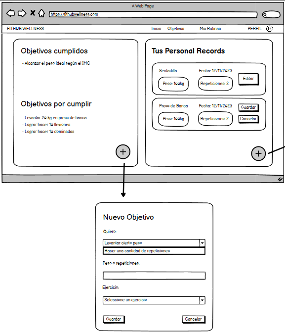

# Historia de usuario 60: Poner objetivo de fitness

- Yo: como usuario de la aplicación,
- Quiero: poder poner uno o varios objetivos de fitness,
- Para: poder seguir una rutina de ejercicios personalizada.

## Especificación de requerimientos

- El sistema debe permitir al usuario poner uno o varios objetivos de fitness.
- El sistema tendrá una lista de objetivos de fitness predefinidos.
- El usuario debe poder ver los objetivos de fitness que ha puesto.
- El usuario debe poder editar los objetivos de fitness que ha puesto.

## Análisis

A continuación se presenta la pantalla de poner objetivo de fitness, cuyo funcionamiento es:

1. El usuario esta en la página de objetivos.
2. El usuario hace click en el botón de "Más".
3. El sistema muestra al usuario una lista de objetivos de fitness predefinidos.
4. El usuario puede seleccionar uno o varios objetivos de fitness.
5. El usuario hace click en el botón de "Guardar".
6. El sistema muestra al usuario los objetivos de fitness que ha puesto.
7. El usuario puede editar los objetivos de fitness que ha puesto, seleccionandolos o deseleccionandolos.



## Critertios de aceptación

#### Prototipo de baja fidelidad

- Dado: que el usuario está en la página de objetivos.
- Cuando: el usuario hace click en el botón de "Más".
- Entonces: el sistema muestra al usuario una lista de objetivos de fitness predefinidos.

## Diseño

### Integración con las APIs

#### Al momento de seleccionar objetivos de fitness

Cuando el usuario seleccione un objetivo de la lista de objetivos predefinidos, el sistema cambiará el estado de ese objetivo con un booleano.

- Request: `PUT /api/v1/objetivos/{id}/`

```json
{
    "name": "Objetivo 1",
    "description": "Descripcion del objetivo 1",
    "selected": true
}
```

- Response: `200 OK`

```json
{
    "id": 1,
    "name": "Objetivo 1",
    "description": "Descripcion del objetivo 1",
    "selected": true
}
``` 

#### Al momento de ver los objetivos de fitness que ha puesto

- Request: `GET /api/v1/objetivos/`

- Response: `200 OK`

```json
[
    {
        "id": 1,
        "name": "Objetivo 1",
        "description": "Descripcion del objetivo 1",
        "selected": true
    },
    {
        "id": 2,
        "name": "Objetivo 2",
        "description": "Descripcion del objetivo 2",
        "selected": false
    }
]
```