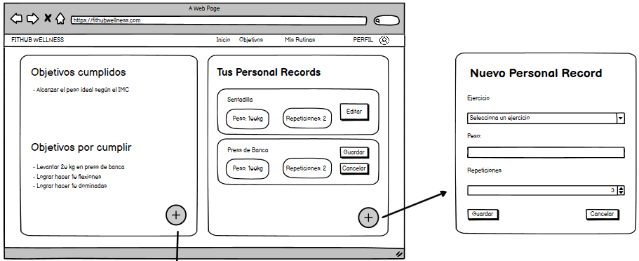

# Historia de usuario 70: Registrar personal record

- Yo: como usuario de la aplicación,
- Quiero: poder registrar un personal record de un ejercicio,
- Para: poder seguir una rutina de ejercicios personalizada.

## Especificación de requerimientos

- El sistema debe permitir al usuario registrar un personal record de un ejercicio.
- El sistema debe permitir al usuario editar un personal record de un ejercicio.
- Los campos de peso y repeticiones deben ser obligatorios.

## Análisis

A continuación se presenta la pantalla de registrar personal record, cuyo funcionamiento es:

1. El usuario hace click en el botón de "Más" de la sección de personal records.
2. El sistema le muestra una nueva pantalla donde puede registrar un personal record de un ejercicio.
3. El usuario puede seleccionar un ejercicio de un combo box de la lista de ejercicios.
4. El usuario puede ingresar el peso y repeticiones del personal record.
5. El usuario hace click en el botón de "Guardar".
6. El sistema muestra al usuario el personal record que ha registrado.



## Critertios de aceptación

#### Prototipo de baja fidelidad

- Dado: que el usuario está en la página de personal records.
- Cuando: el usuario hace click en el botón de "Más" de la sección de personal records.
- Entonces: el sistema le muestra una nueva pantalla donde puede registrar un personal record de un ejercicio.

## Diseño

### Integración con las APIs

#### Al momento de registrar un personal record

Cuando el usuario registre un personal record, el sistema creará un nuevo personal record con los datos ingresados por el usuario. La selección del ejercicio se hará por medio de un combo box de la lista de ejercicios que devuelve la API de Wger.

- Request: `POST /api/v1/personalrecords/`

```json
{
    "exercise": 1,
    "weight": 70,
    "repetitions": 10
}
```

- Response: `200 OK`

```json
{
    "id": 1,
    "exercise": 1,
    "weight": 70,
    "repetitions": 10
}
```

#### Al momento de editar un personal record

Cuando el usuario edite un personal record, el sistema actualizará el personal record con los datos ingresados por el usuario. El usuario solo podrá editar el peso y las repeticiones del personal record.

- Request: `PUT /api/v1/personalrecords/{id}/`

```json
{
    "weight": 70,
    "repetitions": 10
}
```

- Response: `200 OK`

```json
{
    "id": 1,
    "exercise": 1,
    "weight": 70,
    "repetitions": 10
}
```