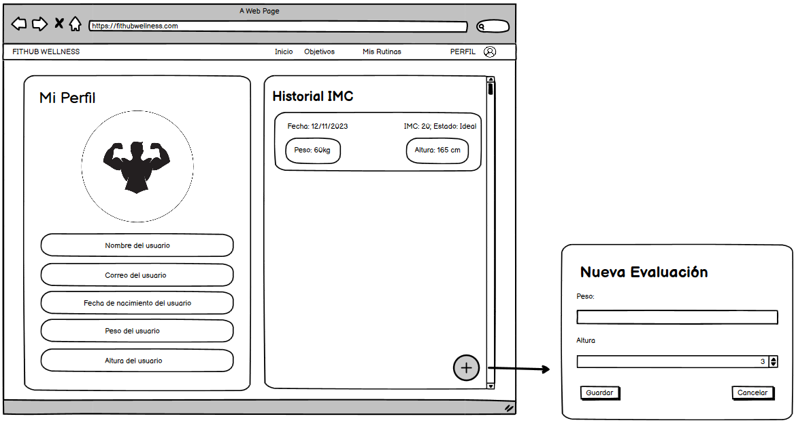

# Historia de usuario 80: Ver historial de evaluaciones

- Yo: como usuario de la aplicación,
- Quiero: poder ver mi historial de evaluaciones,
- Para: poder ver mi progreso personal.

## Especificación de requerimientos

- El sistema debe permitir al usuario ver su historial de evaluaciones.
- El sistema debe mostrar al usuario su peso y altura en cada evaluación junto con la fecha de la evaluación.
- El sistema debe mostrar junto a cada evaluación el imc del usuario en esa evaluación.

## Análisis

A continuación se presenta la pantalla de perfil, cuyo funcionamiento es:

1. El usuario hace click en el botón de "Perfil".
2. El sistema muestra al usuario sus datos y su historial de evaluaciones.
3. El usuario puede ver su peso y altura en cada evaluación junto con la fecha de la evaluación.
4. El usuario tiene la opción de registrar un nuevo peso y altura o evaluación.



## Critertios de aceptación

#### Prototipo de baja fidelidad

- Dado: que el usuario está en la página de perfil.
- Cuando: el usuario hace click en el botón de "Perfil".
- Entonces: el sistema muestra al usuario sus datos y su historial de evaluaciones.

#### Prototipo de baja fidelidad

- Dado: que el usuario está en la página de perfil.
- Cuando: el usuario hace click en el botón de "Más" en la sección de historial de evaluaciones.
- Entonces: el sistema permite al usuario registrar una nueva evaluación de su condición física, donde se le pide peso y altura.

## Diseño

### Integración con las APIs

#### Al momento de ver el historial de evaluaciones

- Request: `GET /api/v1/evaluaciones/`

```json
[
    {
        "id": 1,
        "peso": 70,
        "altura": 1.70,
        "fecha": "2021-06-01",
        "imc": 24.22,
        "estado": "ideal"
    },
    {
        "id": 2,
        "peso": 70,
        "altura": 1.70,
        "fecha": "2021-06-02",
        "imc": 24.22,
        "estado": "ideal"
    }
]
```

#### La parte del perfil

Solo se rescataran los datos de peso y altura de la última evaluación.

- Request: `GET /api/v1/usuarios/1/`

```json
{
    "id": 1,
    "username": "usuario1",
    "email": "usuario1@gmail.com",
    "fecha_nacimiento": "1999-01-01",
    "evaluacion": {
        "id": 1,
        "peso": 70,
        "altura": 1.70,
        "fecha": "2021-06-01",
        "imc": 24.22,
        "estado": "ideal"
    }
}
