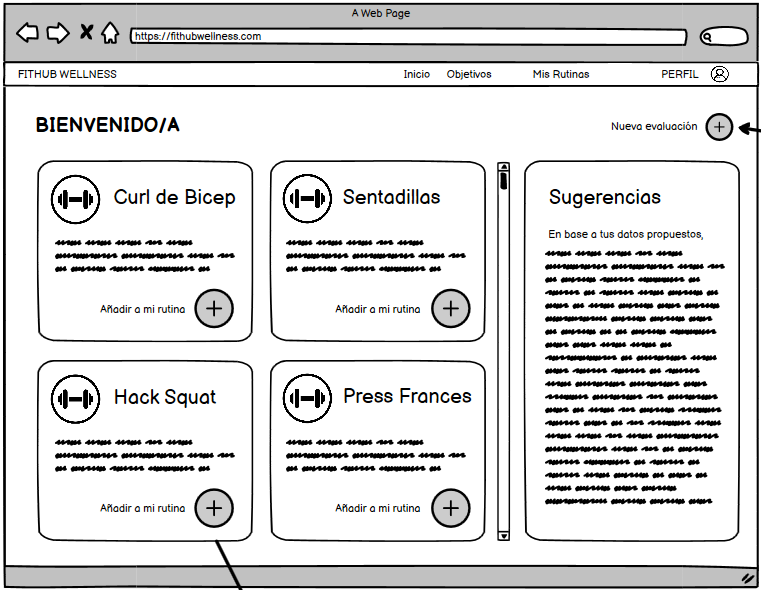

# Historia de usuario de ver partes del cuerpo para entrenar y ver lista de ejercicios para cada parte del cuerpo

Yo: como usuario de la aplicación,
Quiero: ver una página de inicio donde se muestren todos los ejercicios que puedo realizar,
Para: poder seleccionar los ejercicios que deseo realizar y crear una lista de rutinas nueva.

## Criterios de aceptación

- El usuario debe poder ver una lista de que partes del cuerpo puede entrenar.
- El usario debe poder ver una lista de ejercicios que puede realizar, dependiendo de la parte del cuerpo que desee entrenar.

## Análisis y diseño

<br/>

- El usuario debe poder ver una lista de que partes del cuerpo puede entrenar porque es una funcionalidad básica de la aplicación.
- El usario debe poder ver una lista de ejercicios que puede realizar, dependiendo de la parte del cuerpo que desee entrenar porque es una funcionalidad básica de la aplicación.

#### Descripción de la interfaz de usuario

Esta interfaz permitirá al usuario ver una lista de las partes del cuerpo que puede entrenar. Al mismo tiempo, el usuario podrá ver una lista de ejercicios que puede realizar, dependiendo de la parte del cuerpo que desee entrenar. Estas listas de ejercicios se obtienen de una API externa llamada Wger.

### Lo que devuleve la API

- En la pantalla principal de la aplicación se devuelve un get del api externo donde se muestra todos los ejercicios que hay:

    ```
    GET https://wger.de/api/v2/exercisecategory/
    [
        {
            "id": 1,
            "name": "Biceps"
        },
        {
            "id": 2,
            "name": "Pecho"
        },
        ... y así sucesivamente
    ]
    ```

- Al momento de seleccionar una de las categorías que vamos a entrenar obtendremos la lista de los ejercicios que hay en esa categoría:

    ```
    GET https://wger.de/api/v2/exercise/?language=2&category=[ID_CATEGORIA]
    {
        "count": 3
        "results": [
            {
                "id": 1,
                "name": "Martillo",
                "description": "Descripción detallada del ejercicio Martillo...",
                "category": [ID_CATEGORIA],
            },
            {
                "id": 2,
                "name": "Unilateral",
                "description": "Descripción detallada del ejercicio Unilateral...",
                "category": [ID_CATEGORIA],
            },
            {
                "id": 3,
                "name": "Prono",
                "description": "Descripción detallada del ejercicio Prono...",
                "category": [ID_CATEGORIA],
            }
        ]
    }
    ```