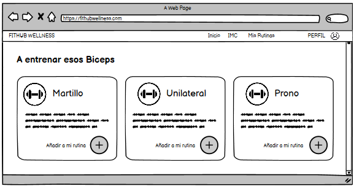

# Historia de usuario de ver ejercicios para cada parte del cuerpo

Yo: como usuario de la aplicación,
Quiero: ver una lista de ejercicios que puedo realizar, dependiendo de la parte del cuerpo que desee entrenar,
Para: poder seleccionar los ejercicios que deseo realizar y crear una lista de rutinas nueva.

## Criterios de aceptación

- El usuario debe poder ver una lista de ejercicios que puede realizar, dependiendo de la parte del cuerpo que desee entrenar.

#### Prototipo de baja fidelidad

- Dado: Que el usuario inicio sesión y se encuentra en la página de inicio de la aplicación.
- Cuando: El usuario seleccione una parte del cuerpo que desea entrenar.
- Entonces: El usuario podrá ver una lista de ejercicios que puede realizar, dependiendo de la parte del cuerpo que desee entrenar.

## Análisis y diseño

<br/>

- El usuario debe poder ver una lista de ejercicios que puede realizar, dependiendo de la parte del cuerpo que desee entrenar porque es una funcionalidad básica de la aplicación.

#### Descripción de la interfaz de usuario

Esta interfaz permitirá al usuario ver una lista de los ejercicios que puede realizar, dependiendo de la parte del cuerpo que desee entrenar. Todo con la finalidad de que el usuario pueda seleccionar los ejercicios que desea realizar y posteriormente crear una lista de rutinas nueva. Cada una de las cards de los ejercicios tendrá un botón que permitirá al usuario agregar el ejercicio a la lista de rutinas nueva.

### Lo que devuleve la API

#### Obtener lista de ejercicios por parte del cuerpo

- Al momento de seleccionar una de las categorías que vamos a entrenar obtendremos la lista de los ejercicios que hay en esa categoría:

    Request:

        ```
        GET https://wger.de/api/v2/exercise/?language=2&category=[ID_CATEGORIA]
        Accept: application/json
        ```

    Response: Exitoso statusCode: 200

    ```
    {
        "count": 3
        "results": [
            {
                "id": 1,
                "name": "Martillo",
                "description": "Descripción detallada del ejercicio Martillo...",
                "category": [ID_CATEGORIA],
            },
            {
                "id": 2,
                "name": "Unilateral",
                "description": "Descripción detallada del ejercicio Unilateral...",
                "category": [ID_CATEGORIA],
            },
            {
                "id": 3,
                "name": "Prono",
                "description": "Descripción detallada del ejercicio Prono...",
                "category": [ID_CATEGORIA],
            }
        ]
    }
    ```

    Response: Error statusCode: 400

    ```
    {
        "detail": "No se pudo obtener la lista de ejercicios"
    }
    ```