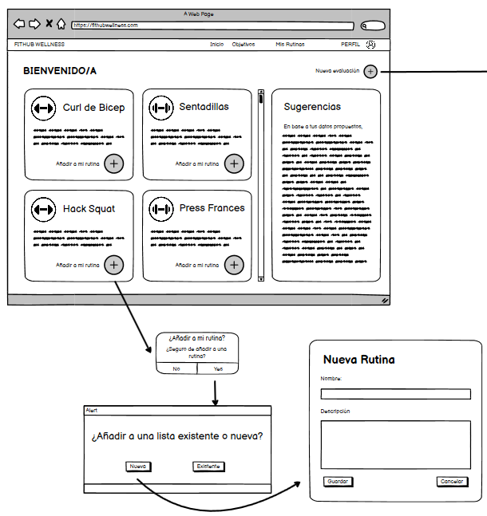

# Historia de usuario de agregar rutina

Yo: como usuario de la aplicación,
Quiero: poder agregar una rutina de entrenamiento,
Para: poder realizarla posteriormente y ver esa lista de rutinas.

## Criterios de aceptación

- El usuario debe poder crear una lista de rutinas nueva.
- El usuario debe poder ver una lista de rutinas de entrenamiento.

## Análisis y diseño

 

- El usuario debe poder crear una lista de rutinas nueva porque es una funcionalidad básica de la aplicación.
- El usuario debe poder ver una lista de rutinas de entrenamiento porque es una funcionalidad básica de la aplicación.

#### Descripción de la interfaz de usuario

Esta interfaz permitirá al usuario crear una lista de rutinas nueva. Al mismo tiempo, el usuario podrá ver las rutinas de entrenamiento que ha creado y los ejercicios que hay dentro de cada rutina.