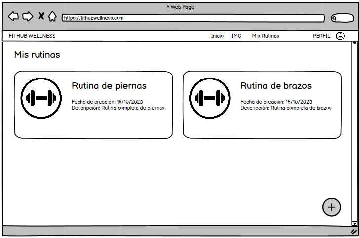

# Historia de usuario de crear rutina

Yo: como usuario de la aplicación,
Quiero: crear una rutina de entrenamiento,
Para: poder agregar los ejercicios que deseo realizar.

## Criterios de aceptación

- El usuario debe poder crear una rutina de entrenamiento.

#### Prototipo de baja fidelidad

- Dado: Que el usuario inicio sesión y se encuentra en la página de mis rutinas de la aplicación.
- Cuando: El usuario seleccione la opción de crear una nueva rutina.
- Entonces: El usuario podrá crear una rutina de entrenamiento.

## Análisis y diseño

<br/>

- El usuario debe poder crear una rutina de entrenamiento porque es una funcionalidad básica de la aplicación.

#### Descripción de la interfaz de usuario

Esta interfaz permitirá al usuario crear una rutina de entrenamiento. Todo con la finalidad de que el usuario pueda agregar los ejercicios que desea realizar. El usuario podrá agregar un nombre y una descripción a la rutina que desea crear. En la parte inferior de la interfaz se encuentra un botón que permitirá al usuario crear la rutina.

### Lo que devuleve la API

#### Crear una lista de rutinas

- Si se quiere crear una lista de rutinas nueva se manda la solicitud del nombre de la rutina y para eso es el siguiente post:

    Request:

    ```
    POST http://localhost:8080/api/v1/users/1/rutinas
    Content-Type: application/json
    Accept: application/json
    {
        "nombreRutina": "Rutina de Fuerza"
        "descripcion": "Con una barra sobre tus hombros, baja tu cuerpo hasta que tus muslos estén paralelos al suelo y luego regresa a la posición inicial."
    }
    ```

    Response: Exitoso statusCode: 201

    ```
    {
        "rutinaId": 1,
        "nombreRutina": "Rutina de Fuerza",
        “fechaCreacion”: “2022-05-05”,
        "descripcion": "Con una barra sobre tus hombros, baja tu cuerpo hasta que tus muslos estén paralelos al suelo y luego regresa a la posición inicial."
    }
    ```

    Response: Error statusCode: 400

    ```
    {
        "detail": "No se pudo crear la rutina"
    }
    ```