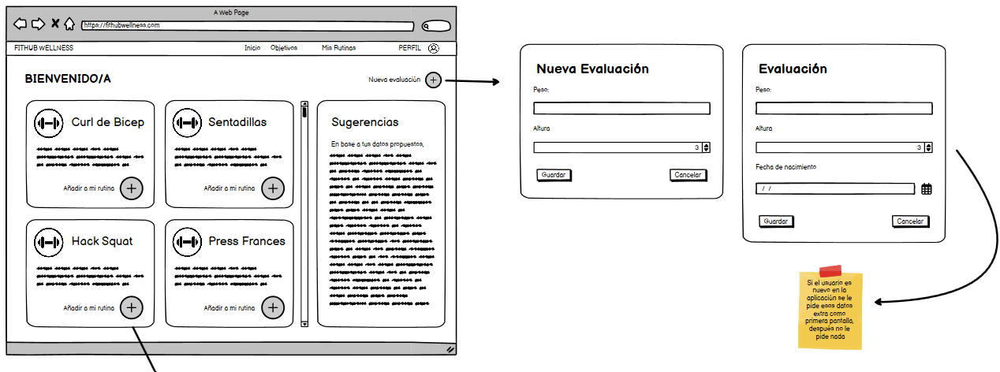
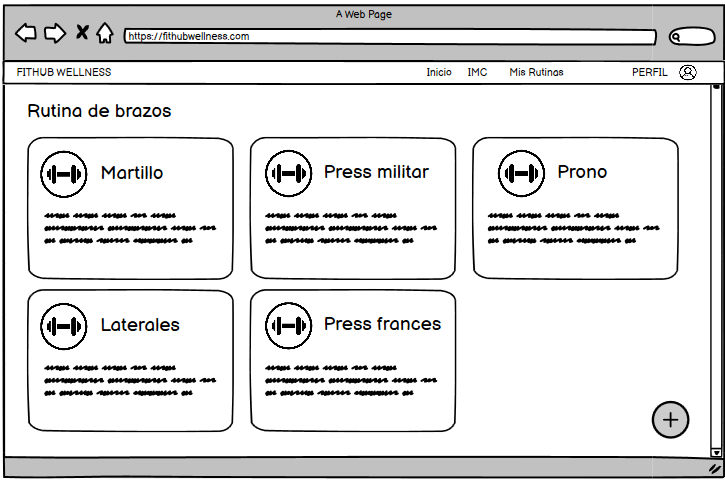

# Historia de usuario de agregar ejercicio a rutina

Yo: como usuario de la aplicación,
Quiero: poder agregar un ejercicio a mi rutina de entrenamiento,
Para: poder realizarlo posteriormente y ver esa lista de ejercicios de mi rutina.

## Criterios de aceptación

- El usuario debe poder agregar un ejercicio a su rutina de entrenamiento.
- El usuario debe poder eliminar un ejercicio de su rutina de entrenamiento.

## Análisis y diseño

<br/>
<br/>

- El usuario debe poder agregar un ejercicio a su rutina de entrenamiento porque es una funcionalidad básica de la aplicación.
- El usuario debe poder eliminar un ejercicio de su rutina de entrenamiento porque es una funcionalidad básica de la aplicación.

#### Descripción de la interfaz de usuario

Esta interfaz permitirá al usuario agregar un ejercicio a su rutina de entrenamiento. Al mismo tiempo, el usuario podrá eliminar un ejercicio de su rutina de entrenamiento.

### Lo que devuleve la API

- Al momento de agregar un ejercicio a la lista de ejercicios de la rutina se manda la solicitud del id que tiene el ejercicio y para eso es el siguiente post dentro de la lista:
    
    ```
    POST http://localhost:8080/api/v1/users/1/rutinas/1/ejercicios
    Content-Type: application/json
    Accept: application/json
    {
        "ejercicioId": 14
    }
    ```

- Al momento de eliminar un ejercicio de la lista de ejercicios de la rutina se manda la solicitud del id que tiene el ejercicio y para eso es el siguiente delete dentro de la lista:

    ```
    DELETE http://localhost:8080/api/v1/users/1/rutinas/1/ejercicios/14
    Content-Type: application/json
    Accept: application/json
    {
        "ejercicioId": 14
    }
    ```