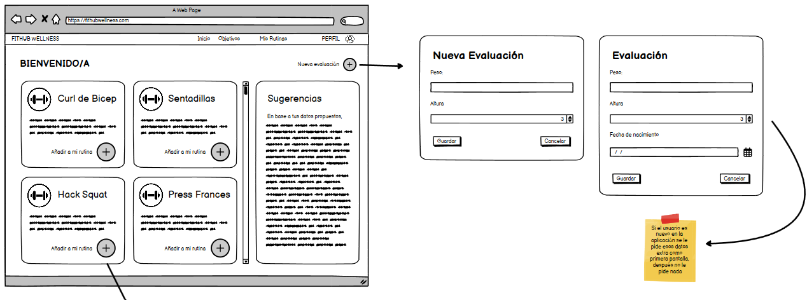

# Historia de usuario de agregar ejercicio a una nueva rutina

Yo: como usuario de la aplicación,
Quiero: poder agregar un ejercicio a una nueva rutina de entrenamiento,
Para: poder realizarlo posteriormente y ver esa lista de ejercicios de mi rutina.

## Criterios de aceptación

- El usuario debe poder agregar un ejercicio a una nueva rutina de entrenamiento.

#### Prototipo de baja fidelidad

- Dado: Que el usuario inicio sesión y se encuentra en la página de mis rutinas/inicio de la aplicación.
- Cuando: El usuario seleccione un ejercicio de la lista de ejercicios.
- Entonces: El usuario podrá agregar ese ejercicio a una nueva rutina de entrenamiento.

## Análisis y diseño

<br/>

- El usuario debe poder agregar un ejercicio a una nueva rutina de entrenamiento porque es una funcionalidad básica de la aplicación.

#### Descripción de la interfaz de usuario

Esta interfaz permitirá al usuario agregar un ejercicio a una nueva rutina de entrenamiento. Todo con la finalidad de que el usuario pueda realizarlo posteriormente y ver esa lista de ejercicios de su rutina. En la fotografia se ve la interfaz de inicio cuando se seleccionó una categoria y se muestra la lista de ejercicios, cada ejercicio tiene un botón que permite agregarlo a la rutina. Posteriormente se muestra una alerta de si se desea añadir a una lista existente o crear una nueva lista, si se selecciona crear una nueva lista se muestra un modal para agregar el nombre y la descripción de la nueva rutina.

### Lo que devuleve la API

#### Agregar ejercicio a una nueva rutina

- Al momento de seleccionar un ejercicio se da la opcion de seleccionar una lista existente o nueva, si es nueva primero se crea la lista de rutinas y luego se agrega el ejercicio a la lista de rutinas:

    Request:
    
        ```
        POST http://localhost:8080/api/v1/users/1/rutinas
        Content-Type: application/json
        Accept: application/json
        {
            "nombreRutina": "Rutina de Fuerza",
            "descripcion": "Con una barra sobre tus hombros, baja tu cuerpo hasta que tus muslos estén paralelos al suelo y luego regresa a la posición inicial."
        }
        ```
    
    Response: Exitoso statusCode: 201
    
        ```
        {
            "rutinaId": 1,
            "nombreRutina": "Rutina de Fuerza",
            “fechaCreacion”: “2022-05-05”,
            "descripcion": "Con una barra sobre tus hombros, baja tu cuerpo hasta que tus muslos estén paralelos al suelo y luego regresa a la posición inicial.",
            "ejercicios": [
                {
                    "ejercicioId": 14,
                    "nombreEjercicio": "Sentadilla",
                    "descripcion": "Con una barra sobre tus hombros, baja tu cuerpo hasta que tus muslos estén paralelos al suelo y luego regresa a la posición inicial."
                }
            ]
        }
        ```
    
    Response: Error statusCode: 400
    
        ```
        {
            "status": 400,
            "error": "Bad Request",
            "message": "La rutina ya existe",
            "path": "/api/v1/users/1/rutinas"
        }
        ```