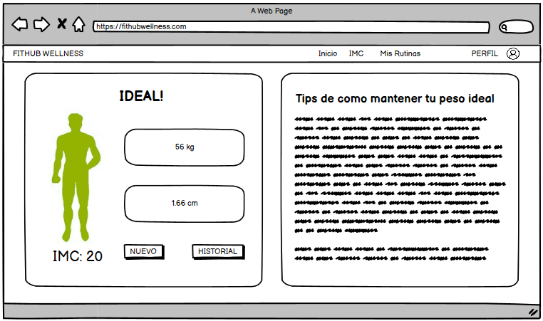

# Historia de usuario de poder ver tu IMC

Yo: como usuario de la aplicación,
Quiero: poder ver mi indice de masa corporal y agregar mi peso y altura,
Para: poder saber si estoy en un peso saludable o no.

## Criterios de aceptación

- El usuario debe poder ver su indice de masa corporal, peso, altura, estado y tip en base a su indice de masa corporal.
- El usuario debe poder agregar su peso y altura.

#### Prototipo de baja fidelidad

- Dado: Que el usuario inicio sesión.
- Cuando: El usuario seleccione la opción de IMC.
- Entonces: El usuario podrá ver su indice de masa corporal, peso, altura, estado y tip en base a su indice de masa corporal.

## Análisis y diseño

<br/>

- El usuario debe poder ver su indice de masa corporal, peso, altura, estado y tip en base a su indice de masa corporal porque es una funcionalidad básica de la aplicación.
- El usuario debe poder agregar su peso y altura porque es una funcionalidad básica de la aplicación.

#### Descripción de la interfaz de usuario

Esta interfaz permitirá al usuario ver su indice de masa corporal, peso, altura, estado y tip en base a su indice de masa corporal. El usuario podrá agregar su peso y altura. El indice de masa corporal se calcula en base a la altura y peso del usuario.

### Lo que devuleve la API

#### Ver IMC

- Al momento de ver su indice de masa corporal, la API devolverá el peso, altura, indice de masa corporal, el tip y el estado en el que se encuentra el usuario. Los tips serán ya almacenados en una tabla en la base de datos y se mostrarán en base a su estado.

    Request:
    
    ```
    GET http://localhost:8080/api/v1/users/1/imc
    ```

    Response: Exitoso statusCode: 200

    ```
    {
        "peso": "56",
        "altura": "1.65",
        "imc": "20.57",
        "tip": "Para mantener un peso saludable, equilibra las calorías que consumes con las que quemas (usa la calculadora de calorías para saber cuántas calorías debes consumir al día), aumenta tu consumo de frutas y verduras, y limita el consumo de alimentos procesados y bebidas azucaradas.",
        "estado": "ideal"
    }
    ```

    Response: Error statusCode: 404

    ```
    {
        "status": 404,
        "error": "Not Found",
        "message": "",
        "path": "/api/v1/users/1/imc"
    }
    ```

#### Agregar IMC

- Al presionar NUEVO se habilitan los campos para añadir un nuevo peso y altura, un post:

    Request:
    
        ```
        POST http://localhost:8080/api/v1/users/1/imc
        Content-Type: application/json
        Accept: application/json
        {
            "peso": "56",
            "altura": "1.65",
        }
        ```

    Response: Exitoso statusCode: 201

        ```
        {
            "peso": "56",
            "altura": "1.65",
            "imc": "20.57",
            "tip": "Para mantener un peso saludable, equilibra las calorías que consumes con las que quemas (usa la calculadora de calorías para saber cuántas calorías debes consumir al día), aumenta tu consumo de frutas y verduras, y limita el consumo de alimentos procesados y bebidas azucaradas.",
            "estado": "ideal"
        }
        ```

    Response: Error statusCode: 400

        ```
        {
            "status": 400,
            "error": "Bad Request",
            "message": "No se pudo agregar el IMC",
            "path": "/api/v1/users/1/imc"
        }
        ```