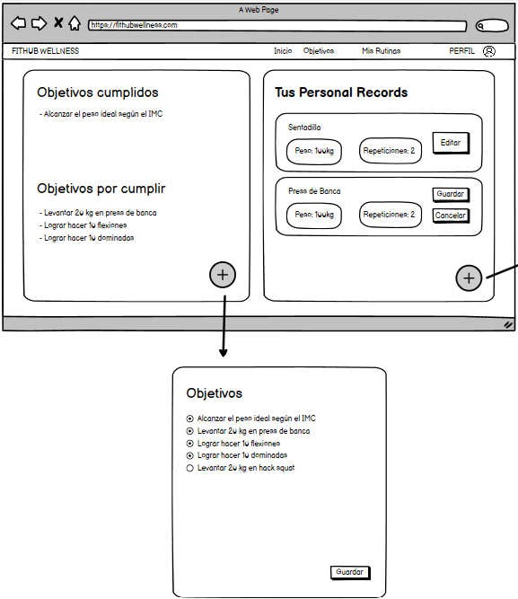

# Historia de usuario de poder ver tu historial de IMC

Yo: como usuario de la aplicación,
Quiero: poder ver mi historial de indice de masa corporal,
Para: poder saber como fue mi progreso con respecto a mi peso.

## Criterios de aceptación

- El usuario debe poder ver su historial de indice de masa corporal.
- El usuario debe poder ver su peso y altura en cada registro de su historial de indice de masa corporal.
- El usuario debe poder ver la fecha en la que se registro cada indice de masa corporal.

## Análisis y diseño

 

- El usuario debe poder ver su historial de indice de masa corporal porque es una funcionalidad básica de la aplicación.
- El usuario debe poder ver su peso y altura en cada registro de su historial de indice de masa corporal porque es una funcionalidad básica de la aplicación.

#### Descripción de la interfaz de usuario

Esta interfaz permitirá al usuario ver su historial de indice de masa corporal. El usuario podrá ver su peso y altura en cada registro de su historial de indice de masa corporal. El usuario podrá ver la fecha en la que se registro cada indice de masa corporal.