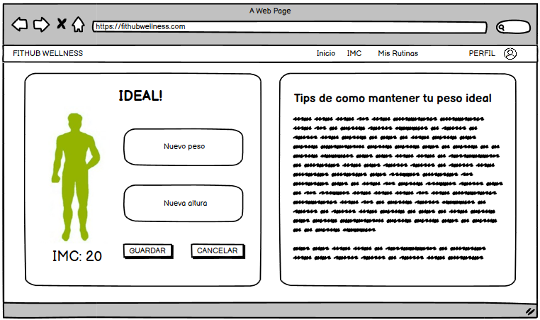

# Historia de usuario de poder agregar nuevo peso y altura

Yo: como usuario de la aplicación,
Quiero: poder agregar mi peso y altura,
Para: poder saber registrar un nuevo IMC.

## Criterios de aceptación

- El usuario debe poder agregar su peso y altura.

#### Prototipo de baja fidelidad

- Dado: Que el usuario inicio sesión y se encuentra en la página de IMC de la aplicación.
- Cuando: El usuario seleccione la opción de agregar nuevo.
- Entonces: En la misma pantalla, el usuario podrá agregar su peso y altura.

## Análisis y diseño

<br/>
<br/>

- El usuario debe poder agregar su peso y altura porque es una funcionalidad básica de la aplicación.

#### Descripción de la interfaz de usuario

Esta interfaz permitirá al usuario agregar su peso y altura. El usuario podrá agregar su peso y altura. En la parte derecha de la interfaz se encuentra un botón 'nuevo' que permitirá al usuario agregar su peso y altura. En la segunda fotografia se muestra como los campos se habilitan al presionar el botón 'nuevo'.

### Lo que devuleve la API

#### Agregar IMC

- Al presionar NUEVO se habilitan los campos para añadir un nuevo peso y altura, un post:

    Request:
    
        ```
        POST http://localhost:8080/api/v1/users/1/imc
        Content-Type: application/json
        Accept: application/json
        {
            "peso": "56",
            "altura": "1.65",
        }
        ```

    Response: Exitoso statusCode: 201

        ```
        {
            "peso": "56",
            "altura": "1.65",
            "imc": "20.57",
            "tip": "Para mantener un peso saludable, equilibra las calorías que consumes con las que quemas (usa la calculadora de calorías para saber cuántas calorías debes consumir al día), aumenta tu consumo de frutas y verduras, y limita el consumo de alimentos procesados y bebidas azucaradas.",
            "estado": "ideal"
        }
        ```

    Response: Error statusCode: 400

        ```
        {
            "status": 400,
            "error": "Bad Request",
            "message": "No se pudo agregar el IMC",
            "path": "/api/v1/users/1/imc"
        }
        ```