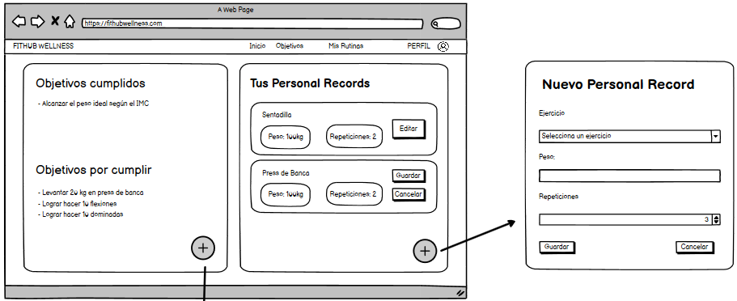

# Historia de usuario de poder ver tus datos personales

Yo: como usuario de la aplicación,
Quiero: poder ver mis datos personales,
Para: poder ver mi información.

## Criterios de aceptación

- El usuario debe poder ver sus datos personales.

#### Prototipo de baja fidelidad

- Dado: Que el usuario inicio sesión.
- Cuando: El usuario seleccione la opción de ver perfil.
- Entonces: El usuario podrá ver sus datos personales.

## Análisis y diseño

 

- El usuario debe poder ver sus datos personales porque es una funcionalidad básica de la aplicación.

#### Descripción de la interfaz de usuario

Esta interfaz permitirá al usuario ver sus datos personales. El usuario podrá ver sus datos personales. Esto se logrará gracias a las funciones de 0Auth2.